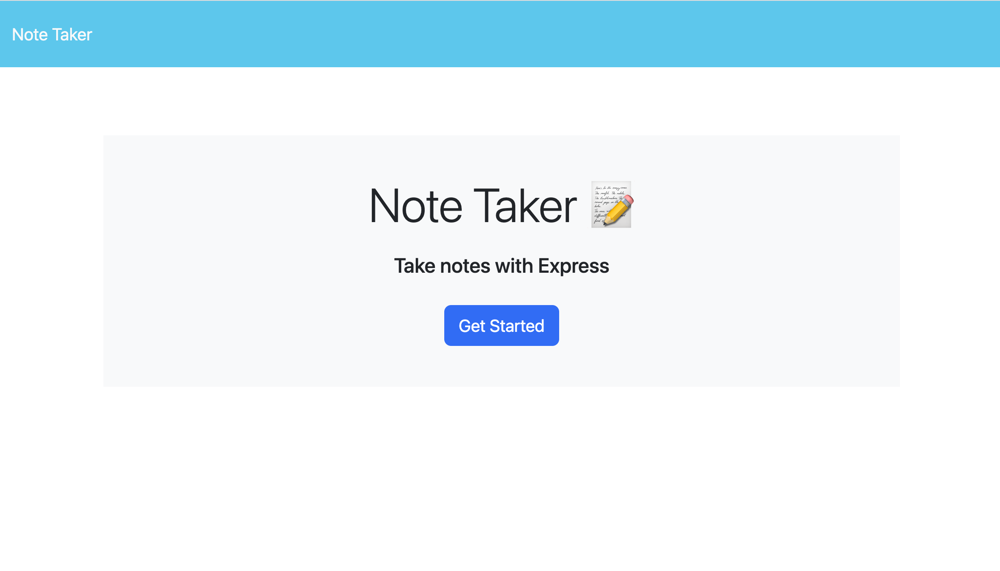
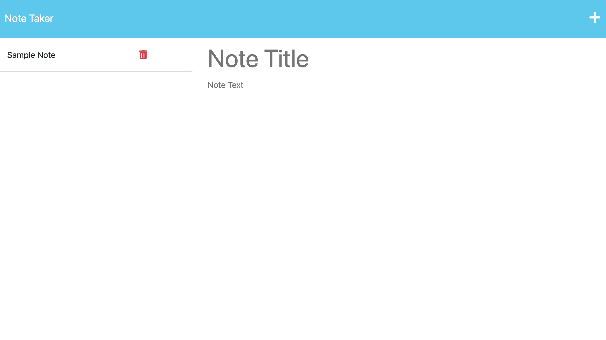

# 11: Note Taker     

## Description

An application to write and save notes that has an Express.js backend and is deployed on Heroku.  

  

## Table of Contents

- [Installation](#installation)
- [Usage](#usage)
- [License](#license)
- [Tests](#tests)
- [Credits](#credits)
- [How to Contribute](#how-to-contribute)
- [Questions](#questions)

## Installation
N/A

## Usage

From the [Note Taker Homepage](https://rkgs-11-note-taker.herokuapp.com/), click "Get Started" to access the Note Taker. Existing notes (if any) are shown in the notes list on the left side.  
- To view the details of an existing note: click on the note in the notes list to view the Note Title and Note Text in the main area.   
- To delete an existing note: click the "🗑️" on the note in the notes list.  
- To add a new note: click the "+" in the top right corner, enter a Note Title and Note Text in the main area, then click the "💾" in the top right corner. The new notes will be added to the notes list on the left.  

## License

This project is covered under the following license: MIT License  
Refer to LICENSE in the repo for additional details.

## Tests

N/A

## Credits

N/A

## How to Contribute

[Contributor Covenant](https://www.contributor-covenant.org/)

## Questions

For questions or suggestions, contact:  
GitHub: [@aerostokes](https://github.com/aerostokes)  
Email: [rhonda@aerostokes.com](mailto:rhonda@aerostokes.com)